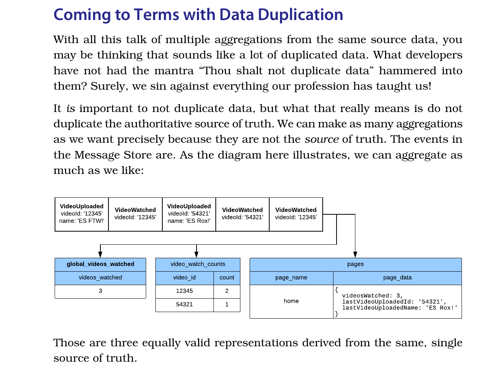

# Practical MS con .net y wolverinefx/martendb

## Notas

### Capitulo 3

En el capitulo 3 se define el message store el cual utiliza como backend una base de postgres sql.

Para la categoría de mensajes define los siguientes tipos

* Eventos: Se cualifican en tiempo pasado y representan algo que ya ocurrio en el sistema
* Comandos: Se cualifican en imperativo y reprensentan una accion a ejecutar.

Nunca deben escribirse en el mismo stream, ademas para cada tipo se propone un prefijo que distingue el mismo.

> Both commands and events will have these fields, since they only differ by whether or not the type is imperative or past tense. You’ll also never put commands in the same stream as events, but the storage mechanism can’t tell the difference.

Del lado de marten, estos tipos se pueden llevar en stream para los eventos y para los comandos se utilizara cascading messages.

<https://wolverinefx.net/guide/handlers/cascading.html#cascading-messages>
<https://jeremydmiller.com/2024/02/13/side-effects-vs-cascading-messages-in-wolverine/>

De las notas entonces:

Eventos/Stream (libro) -> Eventos/Stream (WolverineFx)
Comands/Stream (libro) -> Messages/CascadingMessages (WolverineFx)

Y para optimistic concurrency control

<https://martendb.io/tutorials/advanced-considerations.html#optimistic-concurrency-with-marten>

### Capitulo 4

Conceptos de event sourcing
<https://martendb.io/events/learning.html#core-concepts-of-event-sourcing>

Aggregators

Los agregadores son clases que permiten reconstruir el estado actual de una entidad a partir de una secuencia de eventos. En Marten, los agregadores se utilizan para aplicar eventos a un estado inicial y producir el estado final de una entidad.

Las reglas de negocio se implementan en los handlers.

Para el caso propuesto de llevar el contador de videos vistos total, se define un MultiStreamProjection
<https://martendb.io/events/projections/multi-stream-projections.html#event-fan-out-rules>
<https://martendb.io/tutorials/cross-aggregate-views.html>

<https://wolverinefx.net/guide/durability/marten/event-sourcing.html>

#### Extras

* User videos watched count
* Video watched count

## Conceptos de Event Sourcing

